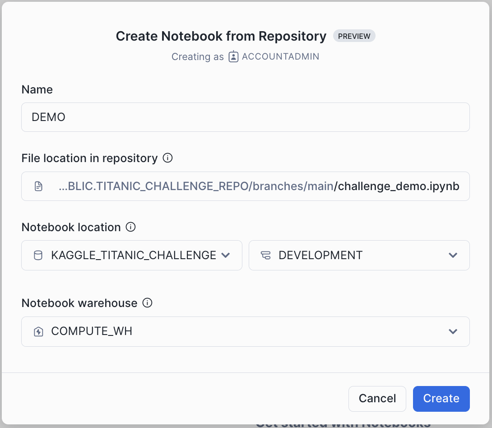
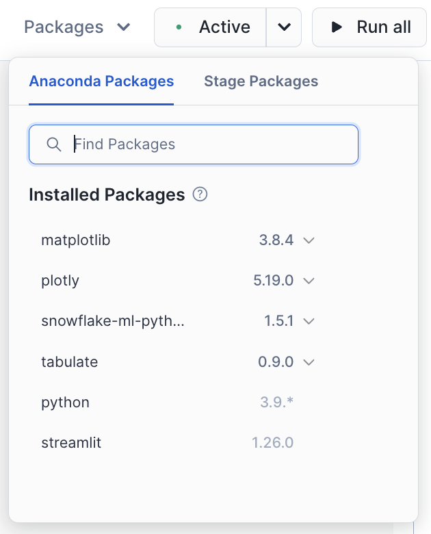

# Snowflake: Titanic - Machine Learning from Disaster
Source:  
https://www.kaggle.com/competitions/titanic

## The Challenge
The sinking of the Titanic is one of the most infamous shipwrecks in history.

On April 15, 1912, during her maiden voyage, the widely considered “unsinkable” RMS Titanic sank after colliding with an iceberg. Unfortunately, there weren’t enough lifeboats for everyone onboard, resulting in the death of 1502 out of 2224 passengers and crew.

While there was some element of luck involved in surviving, it seems some groups of people were more likely to survive than others.

In this challenge, we ask you to build a predictive model that answers the question: “what sorts of people were more likely to survive?” using passenger data (i.e. name, age, gender, socio-economic class, etc).

## What Data Will I Use in This Competition?
In this competition, you have access to a Snowflake table called **PASSENGERS**.  
This table contains the **PASSENGER_ID** and a label-column **SURVIVED** which indicates whether a passenger sruvived or not.  
We know the survival status for 891 passengers but the status for the remaining 418 passengers is unknown and therefore missing in that table.

In addition, your team of smart datascientists already registered a couple of features in your **Snowflake Feature Store**.  
This feature store includes information about the name, age, gender, socio-economic class, etc. 

Use your datascience expertise to:
* Explore the existing Data
* Develop and Register new Features in the **Feature Store**
* Train and Register a Machine Learning Model in the **Model Registry**
* Create Scores for passengers with unknown survival status

## Evaluation
### Goal
It is your job to predict if a passenger survived the sinking of the Titanic or not.  
For each passenger where the survival status is unknown, you must predict a 0 (died) or 1 (survived).

### Metric
Your score is the percentage of passengers you correctly predict. This is known as accuracy.

## Get Started
Register for a free Snowflake Trial Account:
- [Free Snowflake Trial Account](https://signup.snowflake.com/)

> [!IMPORTANT]
> Some features like the Feature Store require Snowflake Enterprise Edition or higher. Availability of specific Cortex LLM models can be found (here)[https://docs.snowflake.com/en/user-guide/snowflake-cortex/llm-functions#availability].

Integrate this Github Repository with Snowflake by running the following SQL code in a Snowflake Worksheet:
```sql
USE ROLE ACCOUNTADMIN;

-- Create warehouses
CREATE WAREHOUSE IF NOT EXISTS TRAIN_WH WITH WAREHOUSE_SIZE='MEDIUM';
CREATE WAREHOUSE IF NOT EXISTS COMPUTE_WH WITH WAREHOUSE_SIZE='X-SMALL';

-- Create a fresh Database
CREATE OR REPLACE DATABASE KAGGLE_TITANIC_CHALLENGE;
USE SCHEMA KAGGLE_TITANIC_CHALLENGE.PUBLIC;

-- Create the integration with Github
CREATE OR REPLACE API INTEGRATION GITHUB_INTEGRATION_MICHAEL
    api_provider = git_https_api
    api_allowed_prefixes = ('https://github.com/michaelgorkow/')
    enabled = true
    comment='Michaels repository containing all the awesome code.';

-- Create the integration with the Github repository
CREATE GIT REPOSITORY TITANIC_CHALLENGE_REPO 
	ORIGIN = 'https://github.com/michaelgorkow/snowflake_kaggle_titanic_challenge' 
	API_INTEGRATION = 'GITHUB_INTEGRATION_MICHAEL' 
	COMMENT = 'Michaels repository containing all the awesome code.';

-- Fetch most recent files from Github repository
ALTER GIT REPOSITORY TITANIC_CHALLENGE_REPO FETCH;

-- Run the Setup Script from Github
-- You should see three tables (PASSENGER, PASSENGER_FEATURES, PASSENGER_KAGGLE_FEATURES$V1)
EXECUTE IMMEDIATE FROM @KAGGLE_TITANIC_CHALLENGE.PUBLIC.TITANIC_CHALLENGE_REPO/branches/main/_internal/setup.sql;
```

Explore the Example Notebook by creating a new Notebook from the integrated Github Repository using the `challenge_demo.iypnb`:  


  
Make sure to add the required libraries to your Notebook by using the Package Picker at the top:  



## Excercise
After running the example it's your turn to try and improve the pipeline.   
Create a new notebook, select the `challenge_excercise.iypnb` and add the required packages. This excercise notebook comes with predefined excercises but feel free to add any code you think is useful to improve the model.

## Solution
You can check and run the solution by creating a notebook using the `challenge_excercise_solution.iypnb`.

## Snowflake Features in this Challenge
* [Snowflake's Git Integration](https://docs.snowflake.com/en/developer-guide/git/git-overview)
* [Snowpark](https://docs.snowflake.com/en/developer-guide/snowpark/python/index)
* [Snowpark ML](https://docs.snowflake.com/en/developer-guide/snowpark-ml/overview)
* [Snowflake Feature Store](https://docs.snowflake.com/en/developer-guide/snowpark-ml/feature-store/overview)
* [Snowflake Model Registry](https://docs.snowflake.com/en/developer-guide/snowpark-ml/model-registry/overview)
* [Snowflake Cortex](https://docs.snowflake.com/en/user-guide/snowflake-cortex/llm-functions)

## API Documentation
* [Snowpark API](https://docs.snowflake.com/developer-guide/snowpark/reference/python/latest/snowpark/index)
* [Snowpark ML API](https://docs.snowflake.com/en/developer-guide/snowpark-ml/reference/latest/index)
* [Snowflake Feature Store API](https://docs.snowflake.com/en/developer-guide/snowpark-ml/reference/latest/feature_store)
* [Snowflake Model Registry API](https://docs.snowflake.com/en/developer-guide/snowpark-ml/reference/latest/registry)